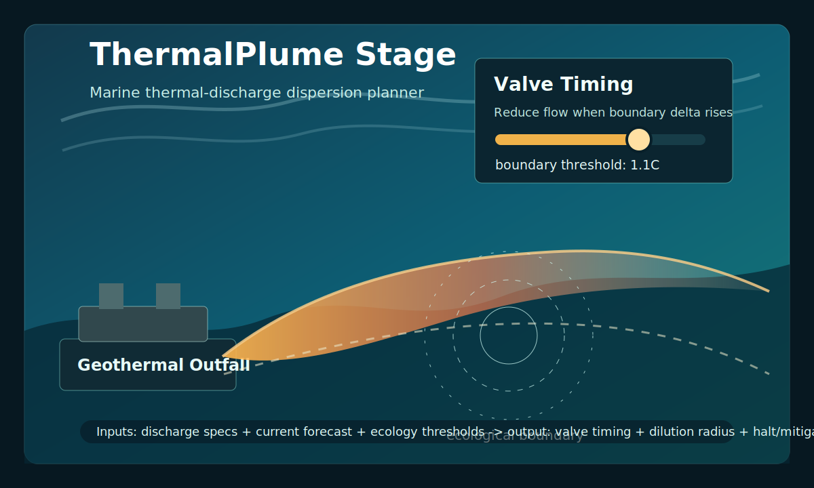

# ThermalPlume Stage

ThermalPlume Stage plans marine thermal-discharge dispersion for geothermal or industrial outfalls. It converts discharge specs, current forecasts, and ecological thresholds into valve timing, spatial dilution windows, and threshold evidence.

[](https://github.com/sadpig70/thermalplumestage/actions/workflows/ci.yml)



## Status

- Source round: `SA-EVX-20260611-001`
- Source artifact: `.sa-evx/rounds/SA-EVX-20260611-001/final_integrated_idea.md`
- Source candidate: `ThermalPlume Stage`
- `cross_model_certified=false`
- `production_promotion_required=true`

This repository is a standalone single-runtime materialization. It must not be presented as production-certified AOX/CIX/EVX output.

## Install

```bash
python -m pip install -e .
```

## Quick Start

```bash
python -m thermalplumestage sample \
  -d examples/discharge_specs.json \
  -f examples/current_forecast.json \
  -e examples/ecology_thresholds.json

python -m thermalplumestage run \
  -d examples/discharge_specs.json \
  -f examples/current_forecast.json \
  -e examples/ecology_thresholds.json \
  --full \
  -o examples/thermalplume_report.json

python -m thermalplumestage run \
  -d examples/discharge_specs.json \
  -f examples/current_forecast.json \
  -e examples/ecology_thresholds.json \
  --markdown \
  -o examples/thermalplume_report.md
```

## Output Shape

Each planned window contains:

- `point_id`
- `hour`
- `recommended_flow_m3_s`
- `valve_fraction`
- `boundary_delta_c`
- `dilution_radius_m`
- `status`
- `evidence_gaps`

## Differentiation

ThermalPlume Stage is not heat monetization, power arbitrage, waste-heat trading, or a bio-release quarantine planner. It is a physical marine thermal-discharge control tool: the primitive is staged valve reduction and dilution scheduling against ecological temperature thresholds.

It differs from `wastestack` because it does not price or lease thermal value. It differs from `powerroam` because it does not move compute to energy. It differs from `coldmkh` because it is not a capacity exchange. It differs from `lazarettostage` because the controlled release is heat into seawater, not engineered organisms.

## Verify

```bash
python -m pytest -q
python -m thermalplumestage sample -d examples/discharge_specs.json -f examples/current_forecast.json -e examples/ecology_thresholds.json
python -m thermalplumestage run -d examples/discharge_specs.json -f examples/current_forecast.json -e examples/ecology_thresholds.json --full -o examples/thermalplume_report.json
python -m thermalplumestage run -d examples/discharge_specs.json -f examples/current_forecast.json -e examples/ecology_thresholds.json --markdown -o examples/thermalplume_report.md
```

